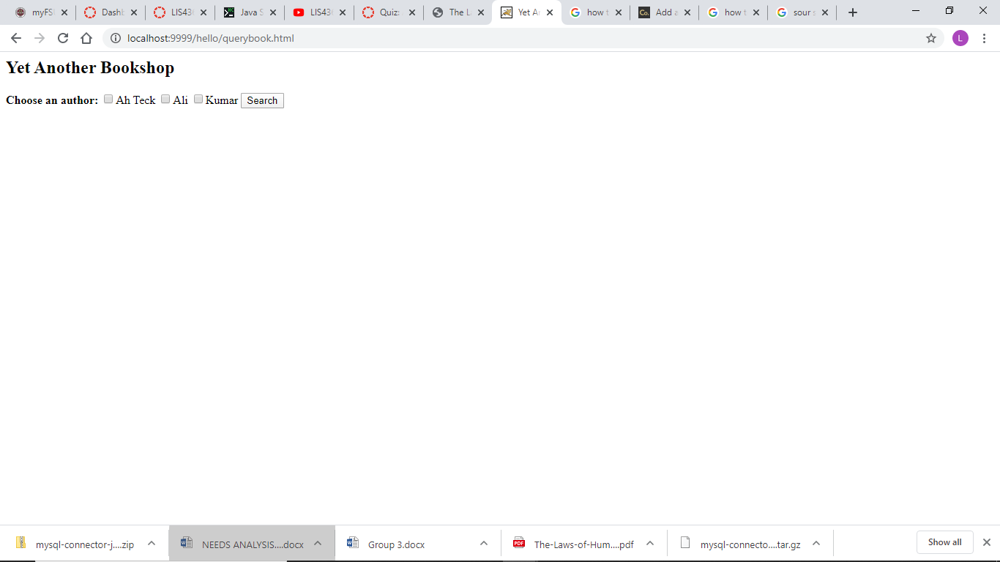

> **NOTE:** This README.md file should be placed at the **root of each of your repos directories.**
>
>Also, this file **must** use Markdown syntax, and provide project documentation as per below--otherwise, points **will** be deducted.
>

# BnB - Beauty on the Beat - Web Application (In The Making)

## Lavonda S. Dean

### Web StoreRequirements:

*Points:*

1. Compile HelloServlet
2. Compile QueryServlet
3. Bitbucket Read-only access

#### README.md file should include the following items:

* HelloHome 
* Querybook
* Screenshot of running localhost 

#### Assignment Screenshots:

*Screenshot of AMPPS running http://localhost*:

*Screenshot of running java Hello*:

